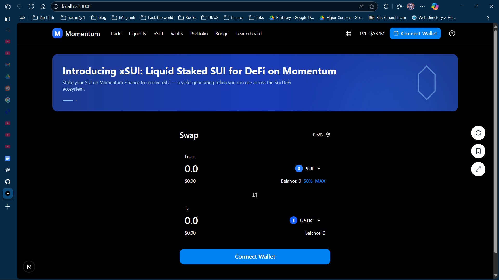
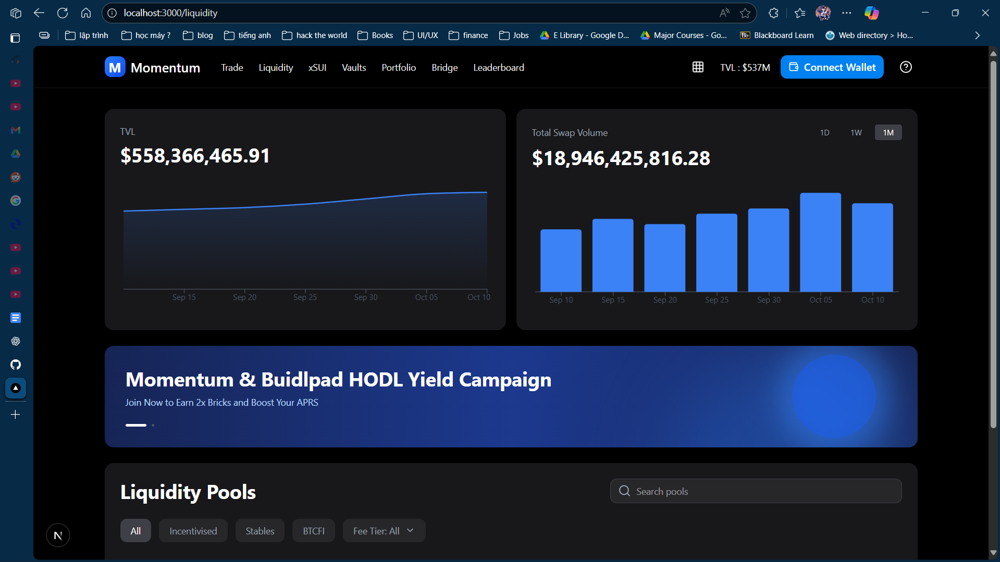

# Module 1: Explore Frontend

## ✅ Tasks

- [ ] Run project: `pnpm install && pnpm dev`
- [ ] Explore swap interface at `/`
- [ ] Explore liquidity pages at `/liquidity`
- [ ] Draw component structure diagram
- [ ] Draw user flow diagram

## 📝 Notes

## 📸 Screenshots

Add screenshots to `screenshots/` folder

## 📅 Completion

- **Submission Date**: 
- **Status**: ⏳ Not Started / 🚧 In Progress / ✅ Completed
